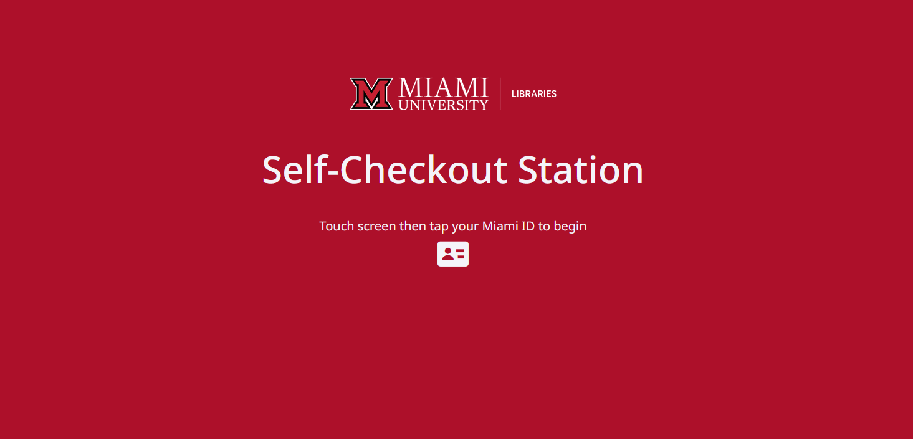
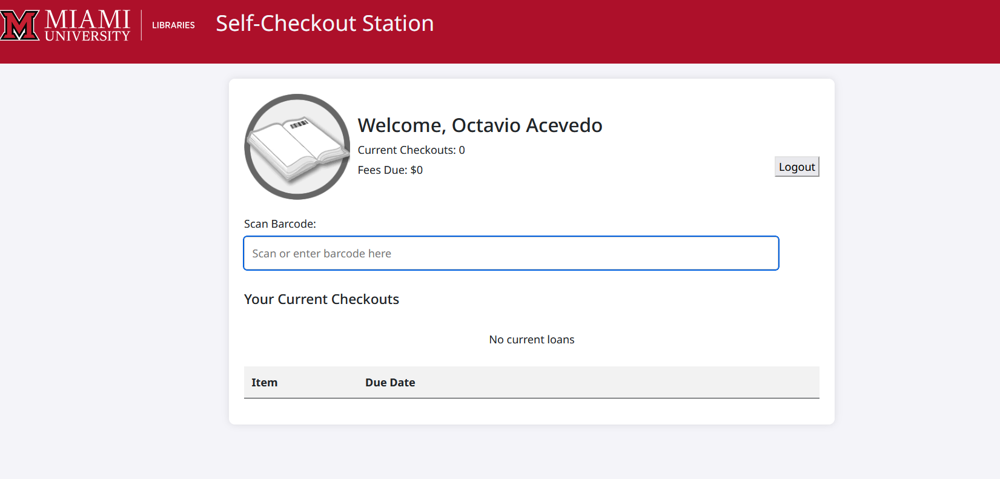

# Alma Self-Checkout Station

A Node.js web application that provides a self-service checkout interface compatible with Ex Libris Alma.

## Features

- Patron authentication via barcode scanning
- Item checkout with barcode scanning
- Real-time display of patron loans
- Session management with inactivity timeout
- Support for various barcode validation formats (Luhn, Modulo43)
- Responsive design for touchscreen interfaces





## Prerequisites

- Node.js (compatible with Node v18 and Node v20, other versions are untested)
- An Ex Libris Alma account with API access
- Valid Alma API key with appropriate permissions

## Installation

1. Clone this repository
2. Install dependencies:
```sh
npm install
```
3. Copy `config/config.sample.js` to `config/config.js`
4. Configure your application settings in `config/config.js`:
   - Add your Alma API credentials
   - Set your institution details
   - Configure timeout settings
   - Set barcode validation format

## Configuration Options

- `AlmaAPI`: Alma API endpoint URL (e.g. https://api-na.hosted.exlibrisgroup.com)
- `API_KEY`: Your Alma API key
- `alma_circ_desk`: Circulation desk code (See https://developers.exlibrisgroup.com/alma/apis/docs/xsd/rest_item_loan.xsd/#item_loan)
- `alma_library`: Library code (See https://developers.exlibrisgroup.com/alma/apis/docs/xsd/rest_item_loan.xsd/#item_loan)
- `barcode_format`: Item barcode validation format ('luhn', 'modulo43', or 'none')
- `inactivityTimeout`: Maximum inactivity time in minutes
- `maxSessionLength`: Maximum session length in minutes
- `port`: Port number, natch
- `institutionDetails`: Branding settings (logo, welcome message, etc.)

## Running the Application

Start the server:

```sh
node index.js
```

The application will be available at `http://localhost:3000` (or your configured port).


## File Structure

- `config/` - Configuration files
- `helpers/` - Utility functions
- `public/` - Static assets (CSS, images)
- `routes/` - Express route handlers
- `views/` - EJS templates